# Linguacare MVP Screens

This document outlines the core screens of the Linguacare platform, categorised by the user roles (Learner, Tutor, Parent/Supporter). The interface is designed based on the "Cozy Studio & Safe Haven" philosophy.

## Learner Screens (Học sinh & Phụ huynh)
Không gian rộng rãi, thoáng đạt, tĩnh lặng giống như một phòng triển lãm nghệ thuật nhỏ. Cực kỳ ít yếu tố gây nhiễu.

### S1: Chào mừng & Chọn mục tiêu
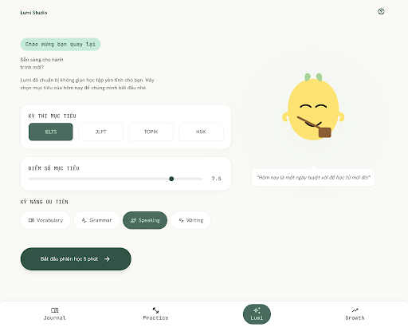

### S2: Emotional Check-in
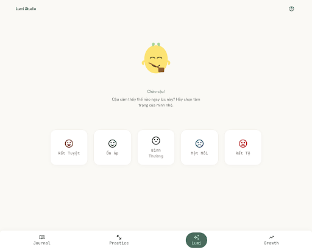

### S3: Story Capture
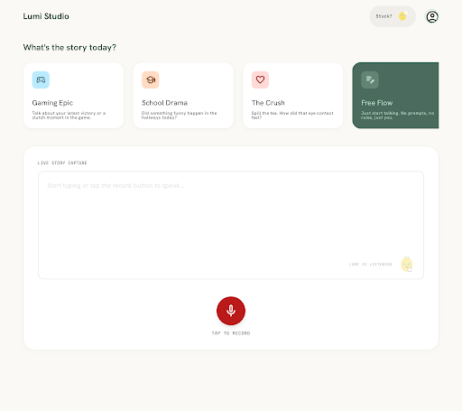

### S4: Target Preview
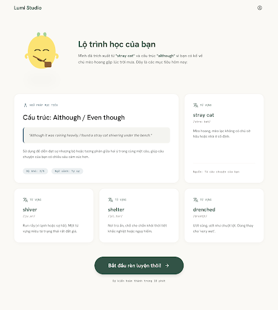

### S5: Guided Sentence Builder
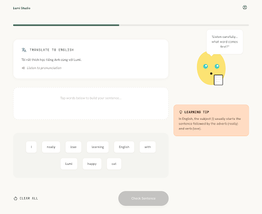

### S6: Full Expression & Speaking
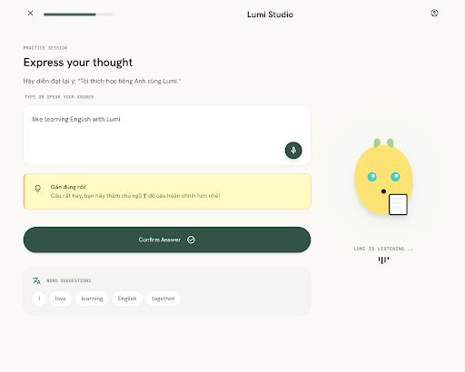

### S7: Variation Switcher
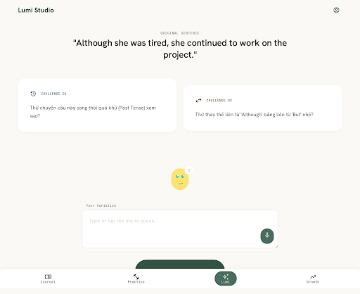

### S8: Exam Grounding Quiz
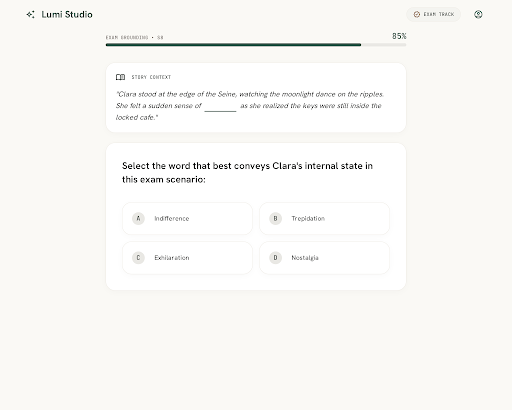

### S9: Learning Gems Recap & Gentle Close
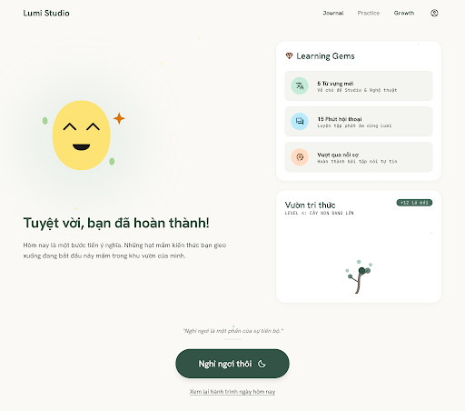

### S10: Bản đồ Tri thức D3.js (Self-Learner)
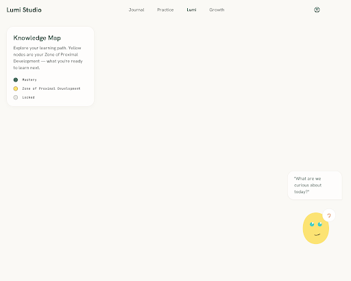

### S11: Bảng xếp hạng Bạn bè Opt-in
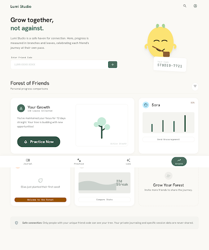

### S12: Cảnh báo Quota & Trợ giúp
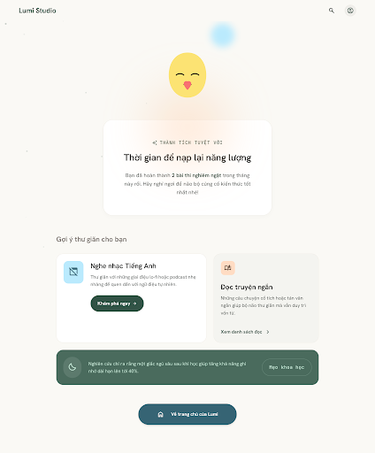

## Tutor Screens (Gia sư)
Gọn gàng, ngăn nắp, có cấu trúc rõ ràng như bàn làm việc của một nhà thiết kế chuyên nghiệp.

### T1: Cohort Analytics Dashboard
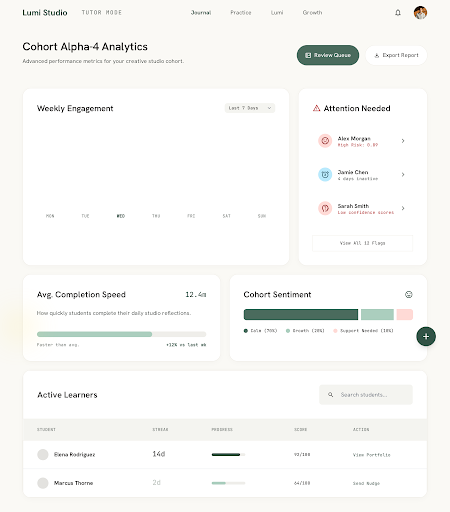

### T2: Student Mastery Graph Visualizer
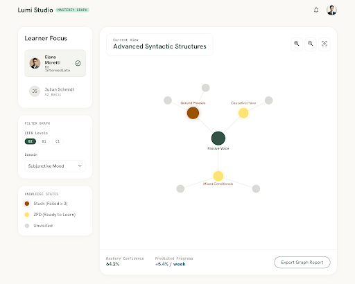

### T3: AI Copilot Homework Planner
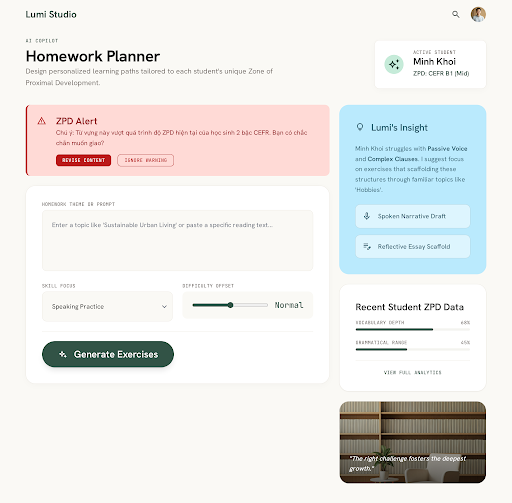

### T4: Content Review Queue
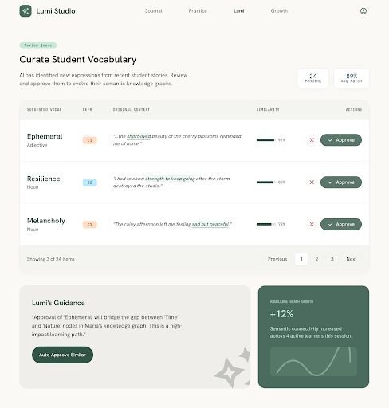

### T5: Goal & Limit Settings
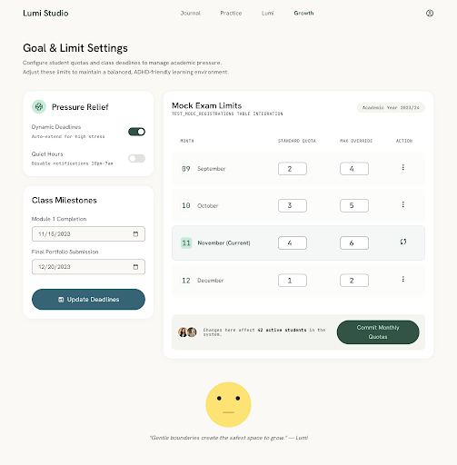

## Parent/Supporter Screens
Mục tiêu "Nâng đỡ tinh thần - Đơn giản tối đa". Giao diện ấm áp.

### S_P1: Family View Dashboard
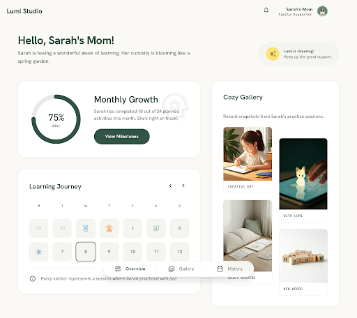

### S_P2: AI Conversation & Encouraging Spark
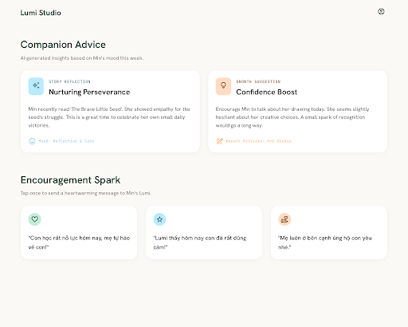

### S_P3: Parental Limits Config
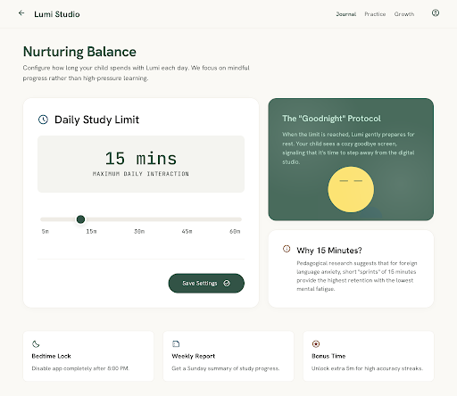
